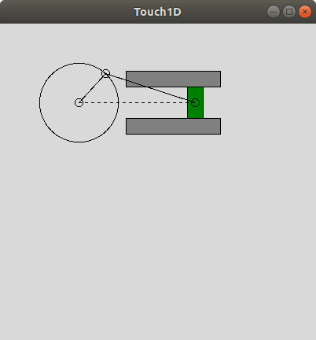
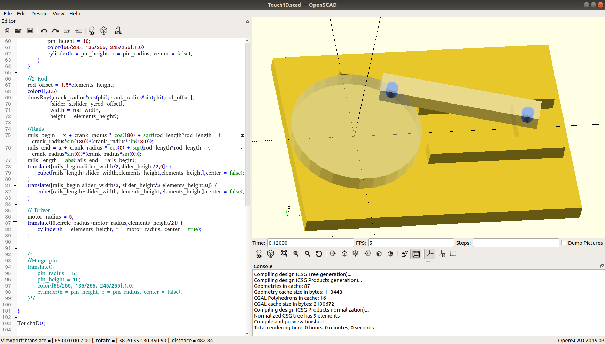

# Touch1D

*Touch1D* is a [open-source software](https://en.wikipedia.org/wiki/Open-source_software) & [open-source hardware](https://en.wikipedia.org/wiki/Open-source_hardware) One dimensional kinesthetic [force feedback device](https://en.wikipedia.org/wiki/Haptic_technology#Force_feedback). The main objective of the project is to study the principles of haptic devices development. Based on the [Slider-crank linkage](https://en.wikipedia.org/wiki/Slider-crank_linkage).

*Touch1D* is under development.

## Getting Started

### Requirements Software
* Python 2.7
* OpenSCAD
* Other

### Requirements Hardware
* Other

### Device structure

### Assembly

* Device structure

* Parts

### Running

* Linux

* Windows

## Screens

## License

License information is in the file [License.md](License.md)

## Authors

* **Maksym Tymkovych** [on github](https://github.com/MaksymTymkovych)

